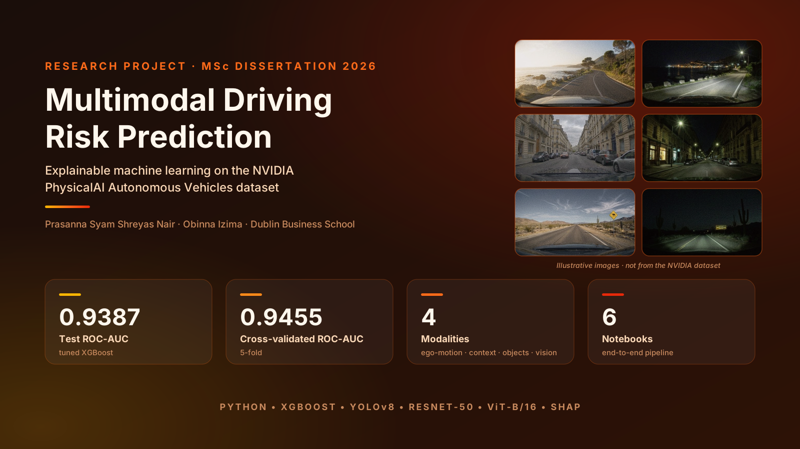
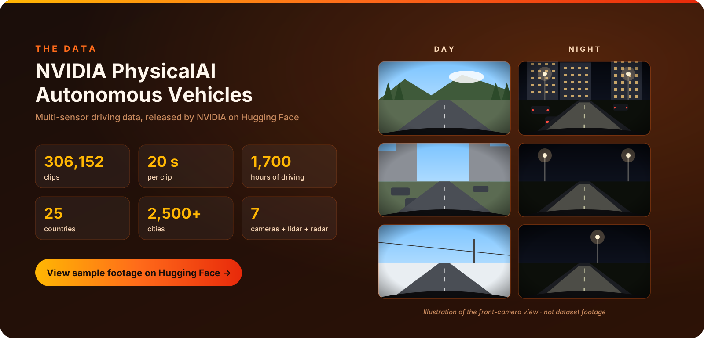
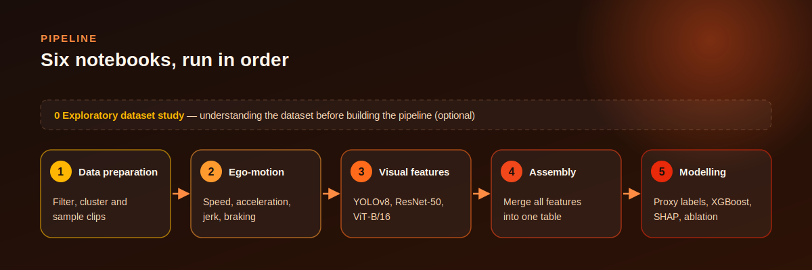
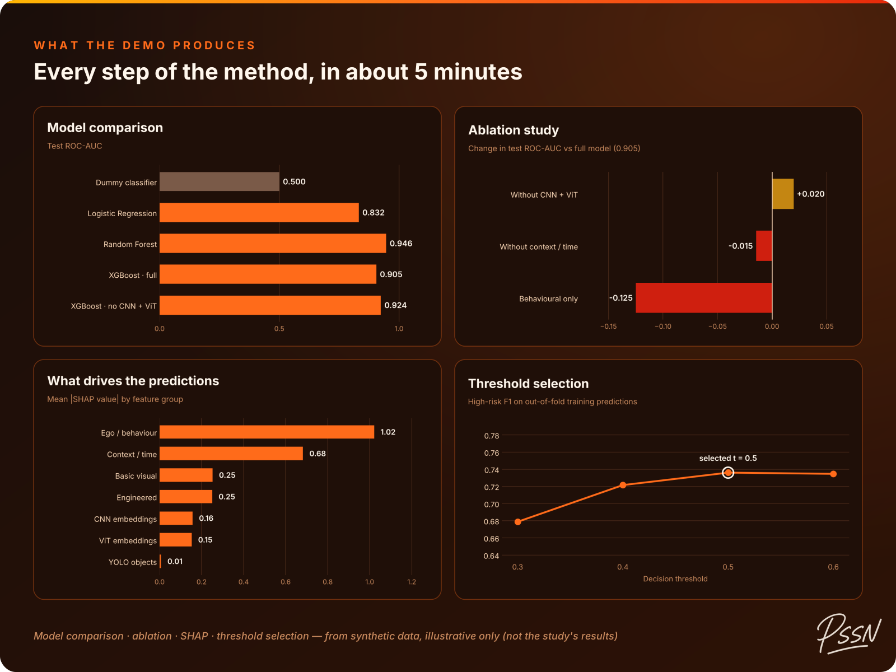
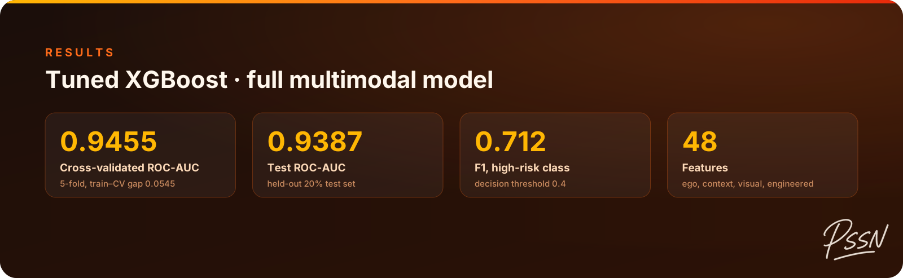
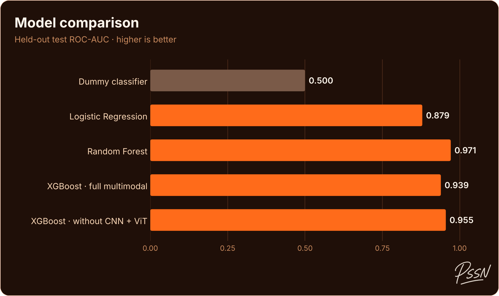
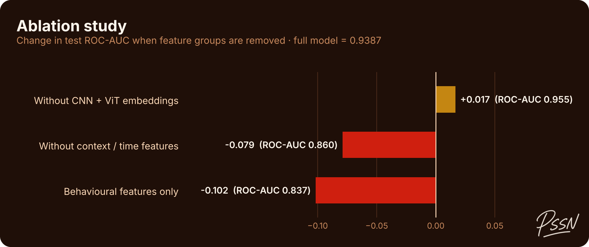
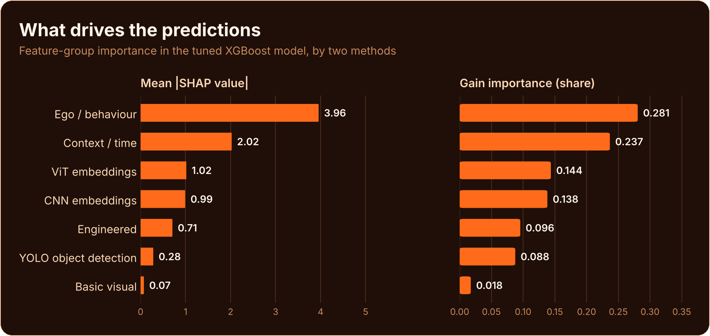

<p align="center">
  
</p>

<p align="center">
  
  
  
</p>

# Multimodal Driving Risk Prediction Using Machine Learning on Autonomous Vehicle Data

This repository contains the code, result tables and figures, dissertation and manuscript drafts for
a research project on **predicting driving risk from autonomous vehicle recordings**. It combines how
the vehicle moved (ego-motion), when it was driving (time-of-day context), and what the front camera
saw (detected objects and deep visual embeddings) into a single machine-learning pipeline.

The work was carried out as an MSc Business Analytics dissertation at Dublin Business School (2026).

## Abstract

Real-world driving data rarely includes crash labels, which makes it hard to train models that recognise
risky driving. This project builds an explainable, multimodal machine-learning pipeline on the NVIDIA
PhysicalAI Autonomous Vehicles dataset that combines four kinds of information about each 20-second
clip: ego-motion telemetry (speed, acceleration, jerk, braking), time-of-day context, YOLOv8 object
counts, and visual features (basic image statistics plus ResNet-50 and Vision Transformer (ViT-B/16)
embeddings).
Because no ground-truth risk labels exist, an Isolation Forest fitted on the training set only creates
proxy risk labels. A tuned XGBoost classifier reached a test ROC-AUC of **0.9387** (cross-validated
**0.9455**). SHAP explanations and ablation studies show which kinds of information drive the predictions:
removing context and time features caused the largest drop in performance, while removing the deep
visual embeddings slightly improved it, suggesting that simply concatenating high-dimensional image
features adds noise at this dataset size.

---

## Contents

- [Abstract](#abstract)
- [Research question](#research-question)
- [The data](#the-data)
- [Approach](#approach)
- [Pipeline](#pipeline)
- [Repository structure](#repository-structure)
- [Reproduce it](#reproduce-it)
- [Running the notebooks](#running-the-notebooks)
- [Results](#results)
- [Limitations](#limitations)
- [Responsible use](#responsible-use)
- [Dissertation and manuscript](#dissertation-and-manuscript)
- [Authors](#authors)
- [Citation](#citation)
- [License](#license)
- [Acknowledgements](#acknowledgements)

---

## Research question

Real driving datasets rarely come with crash or near-miss labels, which makes supervised risk prediction
difficult. This project asks whether a **multimodal framework**, combining vehicle telemetry, temporal
context and visual scene information, can learn a useful notion of driving risk from **proxy labels**
derived from the data itself, and **which kinds of information** drive those predictions.

## The data

<p align="center">
  <a href="https://huggingface.co/datasets/nvidia/PhysicalAI-Autonomous-Vehicles">
    
  </a>
</p>

<p align="center">
  <a href="https://cdn-uploads.huggingface.co/production/uploads/667f467e563b0640e37fca79/t_yqQTwuTRFiiK8--mzm3.gif">
    
  </a>
</p>

This project uses the [NVIDIA PhysicalAI Autonomous Vehicles](https://huggingface.co/datasets/nvidia/PhysicalAI-Autonomous-Vehicles) dataset. Access is gated: sign in to Hugging Face, accept NVIDIA's licence on the dataset page, then run the notebooks to download and process the clips yourself. The [NVIDIA Autonomous Vehicle Dataset License](https://huggingface.co/datasets/nvidia/PhysicalAI-Autonomous-Vehicles/blob/main/LICENSE.pdf) does not allow the dataset, or anything derived from it, to be redistributed, so camera frames, per-clip tables and the trained model are not included here.

To get access:

1. Create a Hugging Face account and accept NVIDIA's licence on the dataset page.
2. Create an access token (Settings → Access Tokens) with read access.
3. Notebooks 1–3 call `login()` and download only the metadata and data chunks they need.

## Approach

| Stage | What is done |
|---|---|
| **Sampling** | Clips with valid ego-motion and front-camera data are clustered (K-Means) and screened for unusual metadata (Isolation Forest), then sampled with a balance of rare and typical scenarios and a per-stratum country cap. |
| **Ego-motion features** | Speed, acceleration, jerk and braking-event counts computed from each clip's vehicle trajectory. |
| **Visual features** | The middle frame of the front wide-angle camera is processed with **YOLOv8** (object counts), **ResNet-50** and **ViT-B/16** (embeddings reduced with PCA), plus brightness and contrast. |
| **Proxy risk labels** | After an 80/20 train/test split, an **Isolation Forest** is fitted on training clips only, using ego-motion and time-of-day features; the most anomalous 25% are labelled *high risk*, and the same fitted model is applied to the test set. |
| **Modelling** | Dummy, Logistic Regression and Random Forest baselines; **XGBoost** with two-phase hyperparameter tuning and class weighting. |
| **Evaluation** | ROC-AUC, precision/recall/F1, 5-fold cross-validation with labels recreated inside each fold, **SHAP** explanations, and ablation studies that remove feature groups. |

## Pipeline

<p align="center">
  
</p>

| # | Notebook | Purpose | Main output |
|---|---|---|---|
| 0 | [`0_exploratory_dataset_study.ipynb`](notebooks/0_exploratory_dataset_study.ipynb) | Explore the dataset's structure and metadata | - |
| 1 | [`1_data_preparation.ipynb`](notebooks/1_data_preparation.ipynb) | Filter, cluster and sample clips | `pipeline_data/01_data_preparation/prepared_dataset_2000.csv` |
| 2 | [`2_ego_motion_features.ipynb`](notebooks/2_ego_motion_features.ipynb) | Compute speed, acceleration, jerk and braking features | `pipeline_data/02_ego_features/ego_features_2000.csv` |
| 3 | [`3_visual_features.ipynb`](notebooks/3_visual_features.ipynb) | Extract frames; YOLOv8, ResNet-50, ViT-B/16, brightness/contrast | `pipeline_data/03_visual_features/visual_features_final.csv` |
| 4 | [`4_dataset_assembly.ipynb`](notebooks/4_dataset_assembly.ipynb) | Merge all features and engineer composite features | `pipeline_data/04_dataset/final_dataset.csv` |
| 5 | [`5_modelling_and_evaluation.ipynb`](notebooks/5_modelling_and_evaluation.ipynb) | Labels, models, tuning, SHAP, ablation | `pipeline_data/05_modelling_outputs/` |

## Repository structure

```
.
├── notebooks/                    # The six pipeline notebooks, as archived
├── reproducible/                 # Ready-to-run version: 5-minute demo + Colab-ready notebooks
├── pipeline_data/                # Folders the notebooks read from and write to
│   ├── 01_data_preparation/      # Empty: created by Notebook 1
│   ├── 02_ego_features/          # Empty: created by Notebook 2
│   ├── 03_visual_features/       # Empty: created by Notebook 3
│   ├── 04_dataset/               # Empty: created by Notebook 4
│   └── 05_modelling_outputs/     # Result tables, tuning logs and figures
├── dissertation/
│   ├── report/                   # Dissertation (PDF)
│   └── presentation/             # Presentation slides (PPTX)
├── manuscript/                   # Manuscript drafts (Word, LaTeX, Overleaf project)
├── docs/images/                  # Figures used in this README
├── requirements.txt              # Python dependencies
├── CITATION.cff                  # Citation metadata
└── LICENSE
```

## Reproduce it

<p align="center">
  <a href="https://colab.research.google.com/github/Nair-Shreyas/multimodal-driving-risk-prediction/blob/main/reproducible/demo/demo_pipeline.ipynb"></a>
</p>

[`reproducible/`](reproducible/) has a ready-to-run version of the pipeline:

- **Demo, about 5 minutes, no NVIDIA access needed.** Open in Colab → *Run all*. It generates synthetic
  clips and runs the full modelling pipeline (proxy labels, baselines, tuned XGBoost, cross-validation, SHAP,
  ablation) so you can see every step of the method.
- **Full study.** Five notebooks with one settings cell each and an "Open in Colab" button, for anyone
  with access to the NVIDIA dataset.

<p align="center">
  <a href="https://colab.research.google.com/github/Nair-Shreyas/multimodal-driving-risk-prediction/blob/main/reproducible/demo/demo_pipeline.ipynb">
    
  </a>
</p>

The reproducible notebooks are version 2 of the pipeline: an optimised, cleaner version of the archived
notebooks that is more robust to updates in the NVIDIA dataset and includes a few bug fixes
([`CHANGES.md`](reproducible/CHANGES.md)).

## Running the notebooks

Clip-level data is not included (see [The data](#the-data)), so the notebooks are run from the start with
your own dataset access. Notebook outputs that displayed dataset rows have been cleared; charts and
printed summaries are kept.

The notebooks were written for **Google Colab** with a **T4 GPU** runtime and **Google Drive** for storage.

1. Copy the `pipeline_data/` folder structure to a folder in your Google Drive.
2. In each notebook, set `base_path` to that folder.
3. Run the notebooks in order (1 → 5). Notebook 0 is optional.

To run outside Colab, install the dependencies first:

```bash
pip install -r requirements.txt
```

| Notebook | GPU needed | Notes |
|---|---|---|
| 1, 2, 4 | No | Notebook 2 downloads ego-motion chunks |
| 3 | Recommended | Downloads camera chunks and runs YOLOv8, ResNet-50 and ViT-B/16 |
| 5 | Recommended | Hyperparameter tuning and SHAP benefit most from a GPU |

## Results

Results from the dissertation. Every value comes from the result files in
[`pipeline_data/05_modelling_outputs/`](pipeline_data/05_modelling_outputs/).

<p align="center">
  
</p>

<p align="center">
  
</p>

<p align="center">
  
</p>

<p align="center">
  
</p>

### Key findings

- Multimodal data identified elevated-risk clips well above the baseline (test ROC-AUC 0.9387 vs 0.5).
- Removing context / time features caused the largest single-group drop in ROC-AUC (−0.079).
- Ego-motion / behaviour features had the highest SHAP and gain importance.
- Removing the CNN and ViT embeddings slightly *improved* performance (+0.017), suggesting that
  simple concatenation of high-dimensional visual embeddings adds noise at this dataset size.
- Random Forest achieved the highest test ROC-AUC (0.971) of the models compared.

<details>
<summary><b>Result tables</b></summary>

#### Model comparison (held-out test set)

| Model | ROC-AUC | Accuracy (t = 0.4) | F1 high risk (t = 0.4) |
|---|---:|---:|---:|
| Dummy classifier | 0.500 | 0.801 | 0.000 |
| Logistic Regression | 0.879 | 0.851 | 0.618 |
| Random Forest | 0.971 | 0.936 | 0.836 |
| XGBoost (full multimodal) | 0.939 | 0.879 | 0.712 |
| XGBoost (without CNN + ViT embeddings) | 0.955 | 0.894 | 0.754 |

#### Ablation study

| Configuration | Features | ROC-AUC | Change vs full model |
|---|---:|---:|---:|
| A: Full model | 48 | 0.9387 | baseline |
| B: No CNN + ViT embeddings | 28 | 0.9554 | +0.0167 |
| C: No context / time features | 43 | 0.8597 | −0.0790 |
| D: Behavioural features only | 8 | 0.8369 | −0.1018 |

#### Feature-group importance

| Feature group | Mean \|SHAP\| | Gain importance |
|---|---:|---:|
| Ego / behaviour | 3.957 | 0.281 |
| Context / time | 2.025 | 0.237 |
| ViT embeddings | 1.017 | 0.144 |
| CNN embeddings | 0.991 | 0.138 |
| Engineered | 0.708 | 0.096 |
| YOLO object detection | 0.282 | 0.088 |
| Basic visual (brightness, contrast) | 0.074 | 0.018 |

The original notebook figures (SHAP summary and waterfall plots, tuning and validation charts) are in
[`pipeline_data/05_modelling_outputs/`](pipeline_data/05_modelling_outputs/).

</details>

## Limitations

As set out in the dissertation (section 6.6):

- **Proxy labels, not crash records.** Risk labels come from anomaly detection, so the model learns
  "unusual driving" as defined by the labelling step rather than measured crash risk.
- **One dataset.** The framework was tested only on the NVIDIA PhysicalAI dataset, so results may not
  carry over to other vehicles, sensor set-ups or driving environments.
- **One frame per clip.** Visual features come from the middle frame of each clip, so motion and
  changes over time within a clip are not captured.
- **Simple fusion of image features.** CNN and ViT embeddings are concatenated with the tabular
  features; the ablation results suggest a better fusion method is needed to get value from them.

## Responsible use

This work is intended for research on driving safety. In line with the NVIDIA Autonomous Vehicle Dataset
License Agreement (sections 4.1, 4.4 and 4.5), the code and models must not be used:

- for surveillance or to monitor the behaviour of individuals;
- to enforce traffic laws or support law enforcement;
- to identify, track or profile people or vehicles (including through licence plates);
- to infer sensitive attributes such as race, gender, age or health, or for biometric or emotion recognition.

The risk labels are statistical proxies, not measured crash risk, so predictions should not be used to make
decisions about real drivers or vehicles.

## Dissertation and manuscript

| Document | Location |
|---|---|
| MSc dissertation (Dublin Business School, May 2026) | [`dissertation/report/`](dissertation/report/) |
| Dissertation presentation | [`dissertation/presentation/`](dissertation/presentation/) |
| Manuscript (Nair & Izima) | [`manuscript/`](manuscript/) |

## Authors

**Prasanna Syam Shreyas Nair** · MSc Business Analytics (First Class Honours), Dublin Business School · Ex-JPMorganChase · [LinkedIn](https://www.linkedin.com/in/psshreyasnair)

**Obinna Izima, PhD** · Dissertation supervisor and manuscript co-author, Dublin Business School · [LinkedIn](https://www.linkedin.com/in/obinna-c-izima-ph-d-52b75524)

## Citation

GitHub's **Cite this repository** button (from [`CITATION.cff`](CITATION.cff)) gives this in APA and BibTeX. To cite the dissertation:

```bibtex
@mastersthesis{nair2026multimodal,
  author = {Nair, Prasanna Syam Shreyas},
  title  = {Multimodal Driving Risk Prediction Using Machine Learning on Autonomous Vehicle Data (NVIDIA Physical AI Dataset)},
  school = {Dublin Business School},
  type   = {MSc Applied Research Project},
  year   = {2026},
  month  = {May}
}
```

## License

The code in `notebooks/` and the README graphics are released under the [MIT License](LICENSE).
The dissertation and manuscript files are © 2026 the authors, all rights reserved. The NVIDIA
PhysicalAI Autonomous Vehicles dataset is not included and remains under NVIDIA's own licence.

## Acknowledgements

This work uses the NVIDIA PhysicalAI Autonomous Vehicles dataset. Thanks to Dublin Business School for
supporting the research and its publication.
